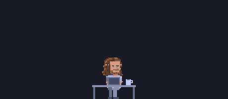
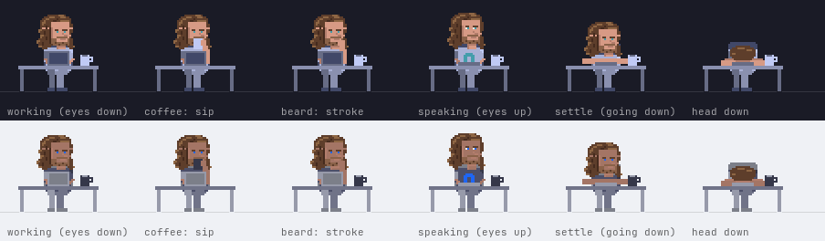

# Yoru — The Omarchy Assistant

> *It looks like you're using a tiling window manager. Would you like help with that?*

A pixel deer lives in the corner of your screen and quietly teaches you
Omarchy. He knows 194 things about it, notices which app you're in,
follows your theme, and — unlike his spiritual ancestor — shuts up when you
tell him to.

He has company. **The Dane — named in honour of Omarchy's creator** — is a
second character who knows everything the deer knows and says it with the
same straight face: `yoru --sprite dane`, or `Super + Ctrl + Shift + Y` to
swap while he's running. See [The Dane](#the-dane).

<p align="center">
  <br>
  <sub>Twenty-five seconds. Smaller and sharper as <a href="docs/yoru-motion.mp4">MP4</a>.</sub>
</p>

---

## Why this isn't Clippy

Clippy wasn't killed by the paperclip. Luke Swartz's 2003 Stanford thesis,
[*Why People Hate the Paperclip*][swartz] — advised by Clifford Nass, whose
lab's research Clippy was built on in the first place — interviewed real users
and found they barely reacted to the character at all. It died of broken
etiquette.

Yoru is built against that autopsy, point by point.

| Clippy did this | Yoru does this |
|---|---|
| Interrupted your work with a modal prompt | Never blocks anything. He's a transparent overlay; clicks pass straight through him |
| Re-offered help you'd already declined, forever | Left click a tip to retire it **permanently** |
| Kept no memory of you between sessions | `known.json` and `seen.json` persist; he gets sharper over time |
| Watched you while you worked | Faces **away** from your screen, and turns to you only when he has something to say |
| Was hard to turn off | Middle click snoozes an hour. `Ctrl+C` kills him. No daemon, no service |
| Talked to an empty chair | Detects idle and stops spending tips when you're gone |
| Was "patronizing" to experts | Teaches keybindings — skills you keep — rather than doing things for you |

That turn-away behavior isn't a flourish. Rickenberg and Reeves found that an
on-screen agent which *watches* the user measurably raises anxiety and lowers
task performance; Swartz's suggested fix is literally "turn away from the user
when not called into service."

The one thing the research said to keep: humor. Agents that joked were rated
*less tedious* and more likeable, with the strongest effect in the entire study
(p < 0.00005). So he's dry, not silent.

---

## What it reads and runs

Everything `yoru.py` touches on your machine, from the source. Paths are
under your home unless shown otherwise.

**Reads**

| Path | When | Why |
|---|---|---|
| `~/.config/yoru/state.json`, `seen.json`, `known.json` | start | his position, tips shown and passes made, tips seen this pass, tips you retired |
| `~/.config/yoru/tips.txt` | start, also for `--list`/`--ask` | your own tips and remarks |
| `~/.config/hypr/bindings.lua` | start, also for `--list`/`--ask` | your `o.bind` lines become tips; a key in it replaces the stock tip for that key. `--no-own` skips it |
| `~/.local/state/omarchy/current/theme/colors.toml` | mtime every 4 s (30 s when you're away); parsed only if `omarchy-theme-color` is absent | notice a theme switch; the palette, as a fallback. Not touched under `--no-theme` |
| `~/.local/state/omarchy/current/theme.name` | mtime on the same beat; contents only with `--debug` | notice a theme switch; name the theme in the log. Not touched under `--no-theme` |

**Writes** — all of it inside `~/.config/yoru/`, which he creates

| Path | When | What |
|---|---|---|
| `state.json` | after a drag, the intro, and each tip | `x`, `y`, `shown`, `passes`, `introduced` |
| `seen.json` | each tip | ids of tips said this pass |
| `known.json` | left click on a tip; `--forget-known` empties it | ids of tips you retired |
| `.<name>.*.tmp` | during each write | written and renamed into place, so a crash can't truncate the file |

**Runs** — every subprocess, with its arguments

| Command | When | Why |
|---|---|---|
| `hyprctl -j activewindow` | every 2 s; every 30 s when you're away or he's snoozed | the focused window's class and title, to pick a tip for the app in front of you. Matched in memory against words like `nvim`, then dropped; the title is never written and never logged |
| `hyprctl -j cursorpos` | same beat | whether the pointer has moved: the presence signal |
| `hyprctl binds` | start, then every 4 s (30 s when you're away) | which bindings exist here, so a rebound key's tip is withheld. `--verify-report` prints the result |
| `omarchy-theme-color --all`, else `omarchy theme color --all` | start, and whenever the theme files' mtime changes | the palette, through Omarchy's own resolver. Never run under `--no-theme` |
| `pacman -Qq` | once at start | which packages are installed, so tips about absent software are withheld. `--no-packages` skips it |

Each has a timeout of five seconds or less, and each fails open: if
`hyprctl` or `pacman` can't be run, nothing is withheld and the palette
stays built in.

**Loads** — `libgtk4-layer-shell.so` through `ctypes`, before GTK, which
is how a layer-shell surface has to be set up. GTK itself connects to the
Wayland display socket, as any window does.

**Not done**

- No network. Nothing in the file imports a socket, an HTTP client or a
  URL; there is no update check and nothing is reported anywhere.
- No `sudo`, no root, nothing written outside `~/.config/yoru`.
- No keyboard. The surface is created with keyboard mode `NONE`; the
  compositor never delivers a key to him. Hiding him is a Hyprland binding
  that sends `SIGUSR1` from outside.
- No clipboard, no screen capture, no reading of other windows' contents —
  only the focused window's class and title, above.
- `--debug` writes to stderr only: decisions, tip ids, window *classes*,
  the theme's name. Not titles.

**At install time**, which is separate from him running: `install.sh` runs
`pacman -Q` for the four dependencies, copies `yoru.py` to
`~/.local/bin/yoru`, and appends one line each to
`~/.config/hypr/autostart.lua` and `~/.config/hypr/bindings.lua`, backing
each up to `<file>.bak-<timestamp>` first. `uninstall.sh` reverses those
and asks before removing `~/.config/yoru`. The package puts the binary at
`/usr/bin/yoru` and prints the two lines instead of writing them.

---

## What he says

Six of the 194, as `yoru --list` prints them:

```
== windows
  Super + K                          Every keybinding at once. Alt + K for tmux, Ctrl + K for Herdr. Nobody memorizes all of them.
  Super + W                          Close the window. No confirmation dialog. There was never going to be one.
  Super + Backspace                  Toggle transparency. Looks incredible, reads terribly. Use sparingly.

== updates
  pacman -Syu                        Omarchy stops you. You'd skip the snapshot, the migrations and the configs, all at once.

== shell
  ff                                 fzf with a preview. Fuzzy find any file below you. Faster than remembering where it is.
  compress [file/dir]                A tar.gz without the flag archaeology. decompress unpacks it.
```

And now and then, between tips, nothing to do with keybindings:

> Nothing here phones home. I checked. I'm the only one watching, and I'm facing the wall.

---

## Scope

**This is the base build.** Yoru knows stock Omarchy 4 (Quattro) — the desktop,
the CLI, the coding agents, the shell tools and functions, tmux, Herdr, Foot,
Neovim/LazyVim, lazygit, lazydocker, btop, Nautilus, browsers, updates and
snapshots. Everything he says was checked against the installed release under
`/usr/share/omarchy` — its scripts, its Lua, its menu — not against the manual
or a search engine. The manual's hotkeys table lists `Super + Q` to close a
window; it isn't bound. See [`tools/`](tools/README.md) for how the tips are
verified and how to redo it when a new version lands.

He knows a little of *your* Omarchy. He checks that a binding still exists
before teaching it, reads your own `bindings.lua` so a key you rebound is
taught in your words rather than the stock ones, and asks `pacman` what's
installed, so there are no Ghostty tips on a Foot machine (see
[Your bindings](#your-bindings)). What he doesn't do yet is in the
[Roadmap](#roadmap).

---

## Install

```bash
git clone https://github.com/nathankramm/yoru.git
cd yoru
./install.sh
```

No sudo. It checks the four dependencies and prints the `pacman` line if any
are missing, puts `yoru.py` at `~/.local/bin/yoru`, adds one
`o.launch_on_start` line to `~/.config/hypr/autostart.lua` and two `o.bind`
lines to `~/.config/hypr/bindings.lua` — `Super + Ctrl + Y` to hide him,
`Super + Ctrl + Shift + Y` to swap him for The Dane (backing each file up
first, and only the lines that aren't there already — running it twice is
safe, and a bind you made by hand for either signal is left alone). Autostart
takes effect at your next login; until then, `yoru &`. The bindings are live
after `hyprctl reload`.

Try the knobs before committing to them:

```bash
yoru --interval 20 --roam 20 --idle 0
```

To update, pull and run it again — it reinstalls only when `yoru.py` has
changed, and leaves everything else alone:

```bash
git pull && ./install.sh
```

`yoru --version` says what you have; put it in a bug report.

`./uninstall.sh` reverses it — stops him, removes the binary, the autostart
line and the binding — and asks before touching `~/.config/yoru`, which is
yours: his position, what he has said, what you retired.

### As a package

```bash
git clone https://github.com/nathankramm/yoru.git && cd yoru && makepkg -si
```

The `PKGBUILD` in the repo builds the tagged release from GitHub, checksum
and all, and installs it through `pacman`. What that buys over `install.sh`:
he shows up in `pacman -Q`, `pacman -R yoru` removes him, and an upgrade is
`git pull && makepkg -si` with the old files replaced cleanly. A package
still can't write the two lines that start him at login and hide him — they
are your own Hyprland config — so `pacman` prints them at install time, with
`/usr/bin/yoru` in place of `~/.local/bin/yoru`. They're the ones in the
by-hand block below.

<details>
<summary>By hand, if you'd rather see each step</summary>

```bash
sudo pacman -S --needed python-gobject gtk4 gtk4-layer-shell python-cairo
install -Dm755 yoru.py ~/.local/bin/yoru
```

Then one line in `~/.config/hypr/autostart.lua`, with your own home directory
spelled out (the launcher runs before your shell has expanded anything):

```lua
o.launch_on_start("/home/you/.local/bin/yoru")
```

And two in `~/.config/hypr/bindings.lua`: `Super + Ctrl + Y` to hide and
show him, `Super + Ctrl + Shift + Y` to swap the character. The pattern is
the full path with a boundary after it, because `SIGUSR1` and `SIGUSR2` kill
any process that has no handler for them — a looser pattern could reach an
editor that happens to have the file open:

```lua
o.bind("SUPER + CTRL + Y", "Toggle Yoru", "pkill -USR1 -f 'python3 /home/you/.local/bin/yoru( |$)'")
o.bind("SUPER + CTRL + SHIFT + Y", "Swap Yoru", "pkill -USR2 -f 'python3 /home/you/.local/bin/yoru( |$)'")
```

Neither key is bound in Omarchy 4.0.4 (`Super + Shift + Y` is YouTube;
`Super + Ctrl + Y` and `Super + Ctrl + Shift + Y` are free). Checked against
the installed release, not the branch.

</details>

---

## Using him

| Action | What happens |
|---|---|
| **Right click** | A tip, now |
| **Left click a tip** | "I know this." Retired permanently |
| **Left click otherwise** | He says something |
| **Middle click** | Snooze one hour. He lies down; again to wake him. On a trackpad, three fingers — a tap or a press, both work out of the box |
| **Drag** | Move him. The spot is remembered across reboots |
| **Super + Ctrl + Y** | Hide him entirely. Again to bring him back |
| **Super + Ctrl + Shift + Y** | Swap the character: the deer for The Dane, and back. Same spot, same way round, same everything |

The last two are Hyprland bindings `install.sh` puts in your `bindings.lua`.
They send `SIGUSR1` and `SIGUSR2` and the process keeps running, so his
position, snooze state and which tips he's seen all survive either one. The
swap goes through the same held settle frame as lying down, so it's a
change, not a cut, and the choice is written to `state.json` — he comes back
as whoever he was. `yoru --swap` sends the same signal from a terminal.

From the terminal, no GUI involved:

```bash
yoru --ask screenshot     # search all 194 tips
yoru --list               # everything, grouped by topic
yoru --forget-known       # un-retire everything
```

### Flags

| Flag | Default | |
|---|---|---|
| `--interval` | 900 | average seconds between utterances — tips and remarks alike; remarks take 15–40% of the slots. 300 until the eighteen first-hour tips are done; doubles per pass through the corpus, to at most 4× |
| `--roam` | 180 | average seconds between short walks |
| `--idle` | 300 | seconds before he assumes you've left (`0` = always on) |
| `--cooldown` | 90 | minimum quiet before a contextual tip |
| `--corner` | `br` | `br`, `bl`, `tr`, `tl` — where he parks on first run |
| `--margin` | 24 | pixels from the side edge on first run. The bottom edge is the ground, so `br`/`bl` stand on it with no gap; `tr`/`tl` keep the gap below the bar, since there's nothing to stand on up there |
| `--scale` | each character's own | screen pixels per sprite pixel, for every character; the deer's is 4, The Dane's is set per character alongside his canvas |
| `--topics` | | e.g. `nvim,tmux` — limit him |
| `--quiet` | | contextual tips only |
| `--no-context` | | ignore the focused window |
| `--no-theme` | | keep the built-in palette; the theme files are never read |
| `--no-own` | | don't turn your own `~/.config/hypr/bindings.lua` binds into tips |
| `--no-basics` | | skip the eighteen first-hour tips he otherwise leads with |
| `--no-packages` | | teach software whether or not `pacman` says it's installed |
| `--start-hidden` | | begin off screen |
| `--still` | | never walk, bound, graze or reach for the coffee — for anyone who finds movement at the edge of vision distracting; he still blinks and talks |
| `--sprite` | saved, else `yoru` | which character: `yoru` (the deer) or `dane` (The Dane). Remembered in `state.json`, so it survives a restart; given, it overwrites the memory |
| `--swap` | | swap the running instance's character (`SIGUSR2`) and exit — what `Super + Ctrl + Shift + Y` does |
| `--version` | | print the version and exit |
| `--monitor` | focused | connector to live on, e.g. `DP-1`; if it isn't connected he warns and takes the focused one |
| `--layer` | `overlay` | `overlay` stays above full-screen windows; `top` goes under them; `bottom` and `background` sit behind everything |
| `--verify-report` | | list the tips this machine's bindings rule out, and exit |
| `--debug` | | log every decision to stderr with a timestamp — attach it to a bug report |

Not everything he says is a tip. Some of it is just him, and how much shifts
over time: a new user gets almost all keybindings — remarks are about 15% of it —
and the share climbs to roughly 40% once you've worked through the manual. He
keeps teaching first, and gets more opinionated as the teaching runs out.

He starts fast and slows down. While any of the eighteen first-hour tips is
unseen he speaks about every five minutes, so a new user has all eighteen
inside the first sitting — about a hundred minutes. After that it's
`--interval`, fifteen minutes by default: three tips and a remark an hour,
and the 194 last a couple of working weeks rather than three days. Each time
he has been through the whole corpus the gap doubles, to at most four times
what you asked for — a second hearing is worth less than a first, and he
should never fall silent. An explicit `--interval` under 300 wins from the
start; so does `--no-basics`. [`tools/exhaust.py`](tools/exhaust.py) is the
model these numbers came from.

---

## The deer

He parks facing the nearer side edge — into the corner, his back to your
screen — and turns toward the middle of it only when he has something to say.
His walks go the other way, into the open, and he turns back when he parks:
an animal moves facing the open and settles facing its cover. Drag him to the
other side and both follow; parked near the middle he keeps whichever way he
last faced rather than flipping on a nudge. Left alone he drops his head and grazes, his ears twitch,
and now and then his tail gives the casual side-to-side wag that is a deer's
all-clear. His walks are a four-beat walk — one foot in the air at a time,
three on the ground, the body level — because at half a body length a second
that is what a mammal does; about one in five, he spooks himself and
bounds instead, and only then does the tail go up, because the flag means
danger is here and a deer standing calmly doesn't say that. None of it does
anything. It's just him.

Snoozed, or once you've been away long enough to count as gone, he lies down:
legs folded under, head pulled back. He blinks, his ears keep going the way a
bedded deer's do, and he chews — short irregular bouts near a whitetail's real rate,
longer stills between — because that's what a bedded deer is doing, and it's
what stops the pose reading as a frozen frame. Bedded a while, he dozes: the eye shuts for
thirty seconds to a few minutes, the cud stops, then he's awake and chewing
again, by turns for as long as he's down. The head never drops — deer lie down
far more than they sleep head-down, and at this size a lowered head read as a
hole in the animal. The ears keep going asleep or awake; they're never
lowered. Snoozed, he stays down: you told him to be
quiet for an hour. Merely away, he still gets up for the odd walk and lies
back down. He gets up when the hour is over or you come back, and before he
says or does anything else. Both ways go through one held frame — head back,
body partway down, legs bent — the same trick as the bound; without it the
change is a teleport, and it's the moment you're watching, since it's what
confirms the middle click took. That pose is the
only visible sign of either state — without it, the one way to check a
middle click had taken was to middle click again, which undid it. `--still`
keeps the pose; it's not movement.

He lives on one monitor. A layer surface belongs to a single output, and the
compositor puts him on whichever one has keyboard focus when he starts;
`--monitor DP-1` picks one instead, and if that output isn't connected he
says so on stderr, names what is, and takes the focused one — so the flag is
safe in `autostart.lua` on a laptop that boots undocked. His saved spot is in
that monitor's own pixels, so it doesn't carry between outputs of different
sizes: a corner on a 1080p screen is mid-screen on a scaled laptop panel. If
the monitor he's on is unplugged, the compositor moves him to another and he
pulls himself back inside its edges, so he stays visible and draggable.

He is cheap to keep. A frame is drawn only when something in it changed — a
blink, an ear, a step — so a parked deer redraws a few dozen times a minute,
not thirty times a second. Hidden with `Super + Ctrl + Y` he does nothing at
all: no stepping, no polling, until you bring him back, with everything as it
was. When you're away, or he's snoozed, the compositor and theme polls slow
from every few seconds to every thirty, and the first sign of you snaps them
back — the window you came back to still gets its tip.

---

## The Dane

**The Dane — named in honour of Omarchy's creator.** A 48×48 man in a plain
tee with a letter O on the chest in the theme's accent, long wavy hair to
the collar, a beard. He is played exactly the way the deer is: the humour
is in the dry lines and never in the movement, and he does ordinary things
with total seriousness. Nothing goofy.

<p align="center">
  <br>
  <sub>Twenty-five seconds of his day, drawn by the code that draws him. Smaller and sharper as <a href="docs/dane-motion.mp4">MP4</a>.</sub>
</p>

He lives at a desk, facing you. A tabletop on two slim legs, him seated
behind it with his legs showing beneath, a laptop open on the desk facing
him — so what you see is the back of the lid — and a mug beside it. He
works, and while he works the only thing that moves is his blink: his
hands are behind the lid, where a keyboard is, and stillness at a desk
reads as concentration. He doesn't roam: wandering out and back is
grazing behaviour, right for an animal, and a man doing it reads as
pacing. The deer still roams; whether a character does is his own data.
Dragging moves the whole scene; it doesn't mirror.

Twice in a long while he stops. Every few minutes he takes his coffee —
his hand out to the mug, the mug up off the desk, and a sip, three held
frames out and the same three back, and the mug goes back down even if
you interrupt him. Perhaps a quarter as often he strokes his beard for a
second, a hand up to his jaw and back behind the laptop. That is the
whole of it. They are the deer's graze, and like the graze they are what
keeps a still drawing from reading as a crashed one — but they are far
rarer than his, because a man at a desk who fidgets every twenty seconds
isn't working, he's a screensaver.

The turn-away is in his eyes. The research is about an agent that
appears to watch you, and gaze is what signals watching: while he works
his eyes are down, on the laptop, so he isn't watching you — through the
coffee and the beard stroke too. Speaking, he closes the laptop: the lid
folds down toward him over two held frames, seven rows of screen to five
to three to one, so it reads as a lid coming down and not as a cut. Then
he looks up at you, and speaks. Closing the laptop is the point: he stops
what he is doing to address you. When the bubble clears he opens it
again, a frame at a time, and his eyes go back down. Snoozed, or once
you've been away, the same fold happens and *then* his head goes down on
folded arms, through a held frame of its own — the laptop is always shut
before he sleeps on it. The props take the theme through the same tones
as his clothes.

<p align="center">
  <br>
  <sub>Every state he has, at the size he ships at, on a dark theme and a light one.</sub>
</p>

Everything that isn't the drawing is the same code. He says the same 194
things, notices the same apps, keeps the same cadence, turns away from you
the same way, and answers the same clicks. His skin, hair and beard are
natural colours and stay put; the shirt, trousers, shoes and the O are the
theme's, through the very tones the deer's coat, antlers and hooves are
made of, so the two recolour together. On a theme whose background is
close to his hair or his skin, that colour moves the one shade it needs to
keep its edge — nine of the twenty-two shipped themes, and the audit names
them.

Start as him with `yoru --sprite dane`; swap while running with
`Super + Ctrl + Shift + Y` (or `yoru --swap`). The choice is remembered.
The deer stays the default.

A third character would be its maps, a palette of roles and a pose table,
with a canvas size, a pixel scale, a list of idle actions and a settle
frame of its own — the Pet reads all of it from the character and nothing
else, and the sprite checks in `tools/audit.py` run from the same data.
An idle action is a held pose, a path of frames into it, how often it
comes and how long it lasts; the deer's graze is a path of one frame,
The Dane's coffee is four.

---

## Context awareness

He reads the focused window from `hyprctl` every two seconds and matches on
class *and* title, so tools running inside your terminal are recognized
separately from the terminal itself:

| Focused | He talks about |
|---|---|
| `foot`, plain | shell tools, tmux, CLI, agents, Herdr |
| `foot` running `nvim` | LazyVim only |
| `foot` running `lazygit` | git only |
| `org.omarchy.agent` | the agent tooling only |
| Something he has no tips for | nothing at all |

At most two contextual tips per app per day, and never within 90 seconds of him
last speaking.

---

## Your bindings

The manual says what a binding *means*; only the running compositor knows
whether it *exists*. At startup, and again every four seconds, he reads
`hyprctl binds` and checks every tip whose keys are a Hyprland binding —
windows, workspaces, panels, capture, the app launchers — against what is
actually bound. A tip whose keys you've unbound, or that this install never
had, is withheld, so he never teaches you a binding you've rebound away.

Only tips in Hyprland topics are checked. tmux, Neovim, Ghostty, lazygit and
shell keys look the same but belong to their own programs and are left alone,
as are your own tips. So are the Chromium extension bindings (`Alt + Shift + L`,
`Alt + Shift + D`): they never appear in `hyprctl binds`, so they're filed as
browser tips rather than compositor ones and aren't checked against it. If
`hyprctl` is missing or its output can't be read, nothing is withheld.

Your own `~/.config/hypr/bindings.lua` is read too. Every `o.bind` in it with
a description becomes a tip in your words (topic `yours`, at most 25, never
checked against the compositor — it came from the config). A key in that file
is one you rebound, so if a curated tip has it as its headline, your tip
replaces it: `Super + S` stops being "the scratchpad" and becomes whatever you
called it. The existence check above couldn't catch that on its own —
`Super + S` was still bound, just to something else — and no table of stock
descriptions was needed to fix it. `--no-own` turns this off.

What isn't installed is withheld too. One `pacman -Qq` at startup drops the
tips that are useless without a package that isn't there: no Ghostty tips on
a Foot machine, no 1Password tip without 1Password. Twenty tips over thirteen
packages; `--no-packages` turns it off.

`yoru --verify-report` prints exactly what he's holding back and why.
`--list` and `--ask` still show everything — suppression only applies to what
he volunteers.

---

## Theming

Yoru follows your Omarchy theme. He reads the live palette through
`omarchy-theme-color --all` — the same resolver the built-in themed templates
use — and repaints within four seconds of a theme switch.

Because the coat is mapped to the theme's **foreground** and the halo to its
**background**, light themes work with no special handling: the deer simply
goes dark.


Tested against all 22 shipped themes.

---

## Your own tips

`~/.config/yoru/tips.txt`, one per line:

```
Super + Shift + V | Open the vault
omarchy-restart-xcompose | After editing ~/.XCompose
```

A line with no `|` becomes idle chatter.

---

## Roadmap

The next versions are about making him yours rather than generic.

- **Weight by what you actually use.** He already watches window focus; over
  weeks that's a real usage model, not uniform random.
- **Generate tips from your own configs** — `bindings.lua` is done (see
  [Your bindings](#your-bindings)); aliases in `~/.bashrc` and your
  scratchpad scripts are not.
- **A position that survives docking.** Corner plus offset, or fractions of
  the surface? Deciding needs a few weeks of actually docking, and either
  changes what `state.json` means for existing users.

**A line this project won't cross.** Personalization here means reading files
you wrote and noticing which window has focus. It will never mean watching
keystrokes to infer which bindings you don't know. That's a keylogger, and it's
precisely the predatory quality that made Clippy hated.

---

## Key Details

| | |
|---|---|
| **Official Name** | Yoru (夜 — "night", after the Tokyo Night palette he was drawn in) |
| **Program/Feature Name** | The Omarchy Assistant |
| **Software** | Omarchy 4 "Quattro" · Hyprland · Wayland |
| **Nickname** | The deer |
| **The other one** | The Dane, named in honour of Omarchy's creator |
| **Predecessor** | Clippit, the Microsoft Office Assistant (1997–2007), may he rest |

---

## Credits

- [Omarchy][omarchy] by DHH and contributors — every tip is traced to its shipped files
- Omarchy's creator, for the operating system that made Yoru worth building — The Dane is named in his honour
- Luke Swartz, [*Why People Hate the Paperclip*][swartz], Stanford, 2003
- [gtk4-layer-shell][gls] by William Wold
- Clippit, designed by Kevan Atteberry, 1997

Built with [Claude][claude].

## License

MIT. Take it and run.

[swartz]: https://xenon.stanford.edu/~lswartz/paperclip/paperclip.pdf
[omarchy]: https://github.com/omacom/omarchy
[gls]: https://github.com/wmww/gtk4-layer-shell
[claude]: https://claude.ai
