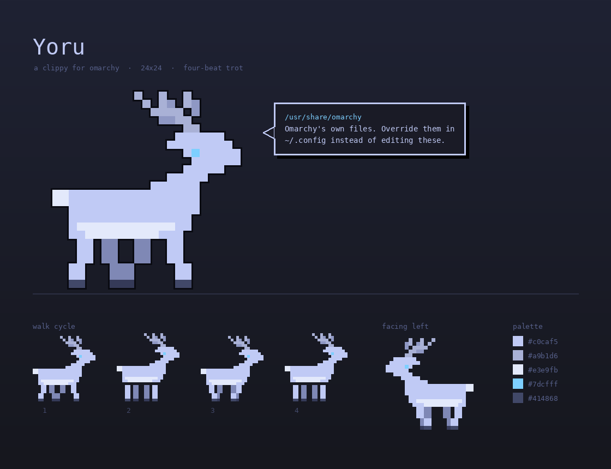
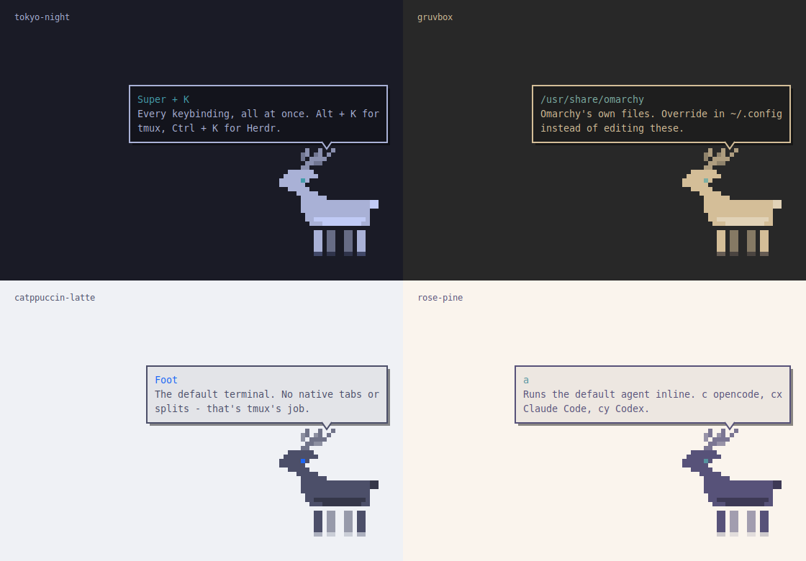

# Yoru — The Omarchy Assistant

> *It looks like you're using a tiling window manager. Would you like help with that?*

A pixel deer lives in the corner of your screen and quietly teaches you
Omarchy. He knows 189 things about it, notices which app you're in,
follows your theme, and — unlike his spiritual ancestor — shuts up when you
tell him to.


<sub>Sixteen seconds. Smaller and sharper as [MP4](docs/yoru-motion.mp4).</sub>

---

## Key Details

| | |
|---|---|
| **Official Name** | Yoru (夜 — "night", after the Tokyo Night palette he was drawn in) |
| **Program/Feature Name** | The Omarchy Assistant |
| **Software** | Omarchy 4 "Quattro" · Hyprland · Wayland |
| **Nickname** | The deer |
| **Predecessor** | Clippit, the Microsoft Office Assistant (1997–2007), may he rest |

---

## Why this isn't Clippy

Clippy wasn't killed by the paperclip. Luke Swartz's 2003 Stanford thesis,
[*Why People Hate the Paperclip*][swartz] — advised by Clifford Nass, whose
lab's research Clippy was built on in the first place — interviewed real users
and found they barely reacted to the character at all. It died of broken
etiquette.

Yoru is built against that autopsy, point by point.

| Clippy did this | Yoru does this |
|---|---|
| Interrupted your work with a modal prompt | Never blocks anything. He's a transparent overlay; clicks pass straight through him |
| Re-offered help you'd already declined, forever | Left click a tip to retire it **permanently** |
| Kept no memory of you between sessions | `known.json` and `seen.json` persist; he gets sharper over time |
| Watched you while you worked | Faces **away** from your screen, and turns to you only when he has something to say |
| Was hard to turn off | Middle click snoozes an hour. `Ctrl+C` kills him. No daemon, no service |
| Talked to an empty chair | Detects idle and stops spending tips when you're gone |
| Was "patronizing" to experts | Teaches keybindings — skills you keep — rather than doing things for you |

That turn-away behaviour isn't a flourish. Rickenberg and Reeves found that an
on-screen agent which *watches* the user measurably raises anxiety and lowers
task performance; Swartz's suggested fix is literally "turn away from the user
when not called into service."

The one thing the research said to keep: humour. Agents that joked were rated
*less tedious* and more likeable, with the strongest effect in the entire study
(p < 0.00005). So he's dry, not silent.

---

## Scope

**This is the base build.** Yoru knows stock Omarchy 4 (Quattro) — the desktop,
the CLI, the coding agents, the shell tools and functions, tmux, Herdr, Foot,
Neovim/LazyVim, lazygit, lazydocker, btop, Nautilus, browsers, updates and
snapshots. Everything he says was checked against the installed release under
`/usr/share/omarchy` — its scripts, its Lua, its menu — not against the manual
or a search engine. The manual's hotkeys table lists `Super + Q` to close a
window; it isn't bound. See [`tools/`](tools/README.md) for how the tips are
verified and how to redo it when a new version lands.

He knows a little of *your* Omarchy. He checks that a binding still exists
before teaching it, and reads your own `bindings.lua` so a key you rebound is
taught in your words rather than the stock ones (see
[Your bindings](#your-bindings)). He'll still mention Ghostty when you're on
Foot. See [Roadmap](#roadmap).

---

## Install

```bash
git clone https://github.com/nathankramm/yoru.git
cd yoru
./install.sh
```

No sudo. It checks the four dependencies and prints the `pacman` line if any
are missing, puts `yoru.py` at `~/.local/bin/yoru`, and adds one
`o.launch_on_start` line to `~/.config/hypr/autostart.lua` (backing it up
first, and only if no yoru line is there already — running it twice is safe).
Autostart takes effect at your next login; until then, `yoru &`.

Try the knobs before committing to them:

```bash
yoru --interval 20 --roam 20 --idle 0
```

`./uninstall.sh` reverses it — stops him, removes the binary and the
autostart line — and asks before touching `~/.config/yoru`, which is yours:
his position, what he has said, what you retired.

<details>
<summary>By hand, if you'd rather see each step</summary>

```bash
sudo pacman -S --needed python-gobject gtk4 gtk4-layer-shell python-cairo
install -Dm755 yoru.py ~/.local/bin/yoru
```

Then one line in `~/.config/hypr/autostart.lua`, with your own home directory
spelled out (the launcher runs before your shell has expanded anything):

```lua
o.launch_on_start("/home/you/.local/bin/yoru")
```

</details>

---

## Using him

| Action | What happens |
|---|---|
| **Right click** | A tip, now |
| **Left click a tip** | "I know this." Retired permanently |
| **Left click otherwise** | He says something |
| **Middle click** | Snooze one hour. Again to wake him |
| **Drag** | Move him. The spot is remembered across reboots |
| **Super + Ctrl + Y** | Hide him entirely. Again to bring him back |

From the terminal, no GUI involved:

```bash
yoru --ask screenshot     # search all 189 tips
yoru --list               # everything, grouped by topic
yoru --forget-known       # un-retire everything
```

### Flags

| Flag | Default | |
|---|---|---|
| `--interval` | 300 | average seconds between ambient tips |
| `--roam` | 180 | average seconds between short walks |
| `--idle` | 300 | seconds before he assumes you've left (`0` = always on) |
| `--cooldown` | 90 | minimum quiet before a contextual tip |
| `--corner` | `br` | `br`, `bl`, `tr`, `tl` — where he parks on first run |
| `--scale` | 4 | pixel size |
| `--topics` | | e.g. `nvim,tmux` — limit him |
| `--quiet` | | contextual tips only |
| `--no-context` | | ignore the focused window |
| `--no-theme` | | keep the built-in palette |
| `--no-own` | | don't turn your own `~/.config/hypr/bindings.lua` binds into tips |
| `--start-hidden` | | begin off screen |
| `--verify-report` | | list the tips this machine's bindings rule out, and exit |
| `--debug` | | log every decision to stderr with a timestamp — attach it to a bug report |

The keybind sends `SIGUSR1` and the process keeps running, so his position,
snooze state and which tips he's seen all survive.

Not everything he says is a tip. Some of it is just him, and how much shifts
over time: a new user gets almost all keybindings — remarks are about 15% of it —
and the share climbs to roughly 40% once you've worked through the manual. He
keeps teaching first, and gets more opinionated as the teaching runs out.

---

## The deer

He parks facing away from your screen and turns to you only when he has
something to say. Left alone he drops his head and grazes, and his ears and
tail twitch the way a standing deer's do. Most of his walks are a trot; about
one in five, he spooks himself and bounds instead, tail flagged. None of it
does anything. It's just him.

---

## Context awareness

He reads the focused window from `hyprctl` every two seconds and matches on
class *and* title, so tools running inside your terminal are recognised
separately from the terminal itself:

| Focused | He talks about |
|---|---|
| `foot`, plain | shell tools, tmux, CLI, agents, Herdr |
| `foot` running `nvim` | LazyVim only |
| `foot` running `lazygit` | git only |
| `org.omarchy.agent` | the agent tooling only |
| Something he has no tips for | nothing at all |

At most two contextual tips per app per day, and never within 90 seconds of him
last speaking.

---

## Your bindings

The manual says what a binding *means*; only the running compositor knows
whether it *exists*. At startup, and again every four seconds, he reads
`hyprctl binds` and checks every tip whose keys are a Hyprland binding —
windows, workspaces, panels, capture, the app launchers — against what is
actually bound. A tip whose keys you've unbound, or that this install never
had, is withheld, so he never teaches you a binding you've rebound away.

Only tips in Hyprland topics are checked. tmux, Neovim, Ghostty, lazygit and
shell keys look the same but belong to their own programs and are left alone,
as are your own tips. So are the Chromium extension bindings (`Alt + Shift + L`,
`Alt + Shift + D`): they never appear in `hyprctl binds`, so they're filed as
browser tips rather than compositor ones and aren't checked against it. If
`hyprctl` is missing or its output can't be read, nothing is withheld.

Your own `~/.config/hypr/bindings.lua` is read too. Every `o.bind` in it with
a description becomes a tip in your words (topic `yours`, at most 25, never
checked against the compositor — it came from the config). A key in that file
is one you rebound, so if a curated tip has it as its headline, your tip
replaces it: `Super + S` stops being "the scratchpad" and becomes whatever you
called it. `--no-own` turns this off.

`yoru --verify-report` prints exactly what he's holding back and why.
`--list` and `--ask` still show everything — suppression only applies to what
he volunteers.

---

## Theming

Yoru follows your Omarchy theme. He reads the live palette through
`omarchy-theme-color --all` — the same resolver the built-in themed templates
use — and repaints within four seconds of a theme switch.

Because the coat is mapped to the theme's **foreground** and the halo to its
**background**, light themes work with no special handling: the deer simply
goes dark.





Tested against all 22 shipped themes.

---

## Your own tips

`~/.config/yoru/tips.txt`, one per line:

```
Super + Shift + V | Open the vault
omarchy-restart-xcompose | After editing ~/.XCompose
```

A line with no `|` becomes idle chatter.

---

## Roadmap

The next versions are about making him yours rather than generic.

- ~~**Catch rebinds, not just unbinds.**~~ Done, and not the way this bullet
  expected. Checking that a key exists couldn't tell that `Super + S` still
  existed but now opened your scratch notes. The fix needed no stock
  description table: a key in your own `~/.config/hypr/bindings.lua` is one
  you rebound, so your description replaces the curated tip. See
  [Your bindings](#your-bindings).
- **Drop what you haven't installed.** A `pacman -Qq` check at startup should
  retire whole topics — no Ghostty tips on a Foot machine.
- **Weight by what you actually use.** He already watches window focus; over
  weeks that's a real usage model, not uniform random.
- **Generate tips from your own configs** — `bindings.lua` is done (above);
  aliases in `~/.bashrc` and your scratchpad scripts are not.
- **Frequency decay**, so he tapers as you learn instead of running at a fixed
  interval forever.

**A line this project won't cross.** Personalization here means reading files
you wrote and noticing which window has focus. It will never mean watching
keystrokes to infer which bindings you don't know. That's a keylogger, and it's
precisely the predatory quality that made Clippy hated.

---

## Credits

- [Omarchy][omarchy] by DHH and contributors — every tip is traced to its shipped files
- Luke Swartz, [*Why People Hate the Paperclip*][swartz], Stanford, 2003
- [gtk4-layer-shell][gls] by William Wold
- Clippit, designed by Kevan Atteberry, 1997

Built with [Claude][claude].

## License

MIT. Take it and run.

[swartz]: https://xenon.stanford.edu/~lswartz/paperclip/paperclip.pdf
[omarchy]: https://github.com/omacom/omarchy
[gls]: https://github.com/wmww/gtk4-layer-shell
[claude]: https://claude.ai
